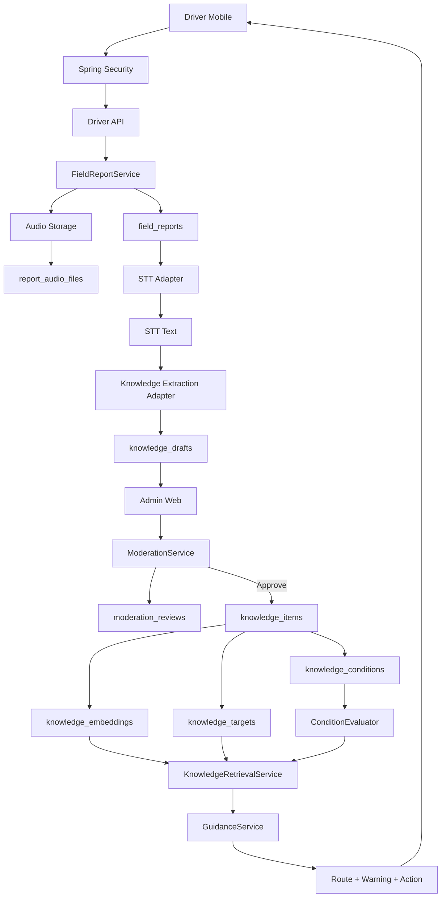
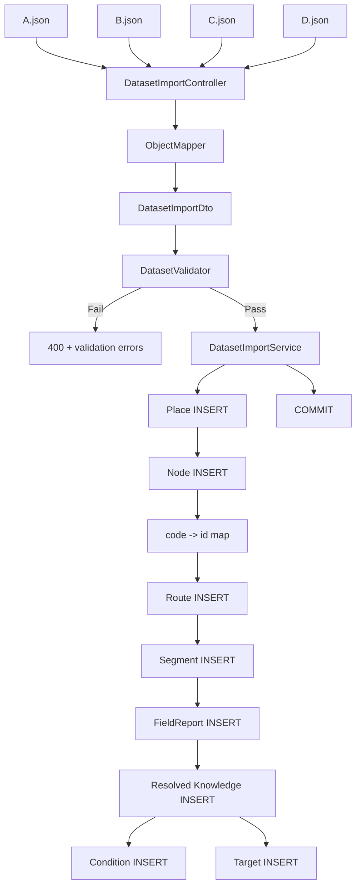
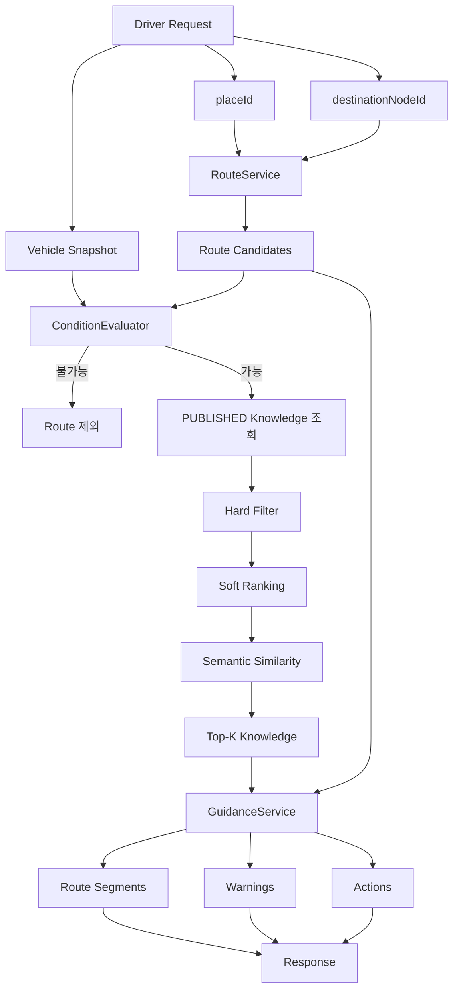

# MOVE-AI Backend Full Guide
## Spring Boot + MariaDB + A~D JSON 연결 + 데이터 흐름 + CLI 지시서

이 문서는 MOVE-AI 백엔드 구현 시 **CLI 코딩 에이전트에게 그대로 전달할 기준 문서**다.

---

# 1. 최종 파일 구성

```text
move-ai/
├── backend/
│   ├── build.gradle
│   ├── src/
│   │   ├── main/
│   │   │   ├── java/com/moveai/
│   │   │   └── resources/
│   │   └── test/
│   └── README.md
│
├── datasets/
│   ├── synthetic_dataset_A.json
│   ├── synthetic_dataset_B.json
│   ├── synthetic_dataset_C.json
│   └── synthetic_dataset_D.json
│
├── db/
│   └── move_ai_all_in_one.sql
│
└── docs/
    └── MOVE_AI_BACKEND_FULL_GUIDE.md
```

현재 제공 파일을 위 구조로 배치한다.

---

# 2. 데이터셋 검증 상태

| Dataset | Nodes | Routes | Segments | Reports | Knowledge | Audio True | UNRESOLVED |
|---|---:|---:|---:|---:|---:|---:|---:|
| A | 15 | 2 | 6 | 10 | 36 | 5 | 6 |
| B | 14 | 2 | 7 | 11 | 37 | 5 | 6 |
| C | 14 | 2 | 6 | 10 | 39 | 5 | 5 |
| D | 14 | 2 | 7 | 10 | 40 | 5 | 4 |

공통 검사 결과:
- Route 연결 오류 없음
- 존재하지 않는 Node/Segment 참조 없음
- `source_excerpt`가 transcript에 없는 오류 없음
- `DRIVE` 값 없음
- A/B/C/D 모두 같은 JSON 구조 사용
- 각 Dataset 실제 녹음 -> STT 대상 `True` 5건

---

# 3. JSON 4개와 DB 1개의 관계

JSON은 팀 작업과 테스트 원본을 위해 A~D 네 파일로 유지한다.

```text
synthetic_dataset_A.json
synthetic_dataset_B.json
synthetic_dataset_C.json
synthetic_dataset_D.json
```

운영 DB는 하나다.

```text
A.json ─┐
B.json ─┤
C.json ─┼──> DatasetImportService ───> MariaDB move_ai
D.json ─┘
```

DB 안에서 A/B/C/D를 별도 DB로 나누지 않는다.

예:

```text
places
+----+------------+------------------------------+
| id | place_code | name                         |
+----+------------+------------------------------+
|  1 | PLACE_A    | 해든마루 센트럴 아파트      |
|  2 | PLACE_B    | ...                          |
|  3 | PLACE_C    | 새별로지스 허브              |
|  4 | PLACE_D    | 해피가든몰                   |
+----+------------+------------------------------+
```

A/B/C/D 구분은 `place_id` FK로 이어진다.

---

# 4. JSON code를 DB에 연결하는 핵심 원리

JSON의 아래 값은 DB PK가 아니다.

```text
PLACE_A
NODE_A_01
ROUTE_A_01
SEG_A_01
REPORT_A_01
K_A_001
```

MariaDB 실제 PK:

```text
places.id
place_nodes.id
routes.id
route_segments.id
field_reports.id
knowledge_items.id
```

모두 `BIGINT AUTO_INCREMENT`.

## 4.1 Place 연결

JSON:

```json
{
  "place_code": "PLACE_A",
  "name": "해든마루 센트럴 아파트"
}
```

DB:

```sql
INSERT INTO places (place_code, name, ...)
VALUES ('PLACE_A', '해든마루 센트럴 아파트', ...);
```

DB 결과:

```text
id = 1
place_code = PLACE_A
```

---

# 5. Node 연결

JSON:

```json
{
  "node_code": "NODE_A_03",
  "parent_node_code": "NODE_A_04"
}
```

SQL에서는 먼저 `node_code`를 저장한다.

그 다음:

```sql
SELECT id
FROM place_nodes
WHERE node_code = 'NODE_A_04';
```

결과가 예를 들어 `25`라면:

```text
NODE_A_04 -> DB id 25
```

`NODE_A_03.parent_node_id = 25`로 연결한다.

통합 SQL 파일에서는 이 연결을 JOIN/SELECT로 자동 수행한다.

---

# 6. Route 연결

JSON:

```json
{
  "route_code": "ROUTE_A_01",
  "start_node_code": "NODE_A_02",
  "destination_node_code": "NODE_A_10"
}
```

MariaDB:

```sql
INSERT INTO routes (
  start_node_id,
  destination_node_id
)
VALUES (
  (SELECT id FROM place_nodes WHERE node_code='NODE_A_02'),
  (SELECT id FROM place_nodes WHERE node_code='NODE_A_10')
);
```

즉:

```text
JSON code
NODE_A_02
    |
    v
place_nodes.id
    |
    v
routes.start_node_id
```

---

# 7. Segment 연결

```text
ROUTE_A_01
   |
   +-- SEG_A_01
   |     NODE_A_02 -> NODE_A_05
   |
   +-- SEG_A_02
   |     NODE_A_05 -> NODE_A_06
   |
   +-- ...
```

DB:

```text
route_segments.route_id
route_segments.from_node_id
route_segments.to_node_id
```

모두 code를 DB id로 변환해서 연결한다.

---

# 8. FieldReport 연결

JSON:

```json
{
  "report_code": "REPORT_A_01",
  "place_code": "PLACE_A",
  "transcript": "...",
  "audio_recording_candidate": true
}
```

DB:

```text
field_reports.place_id
      |
      v
places.id
```

`audio_recording_candidate=true`:

```text
실제 사람이 녹음
-> STT 변환 테스트
-> 합성 transcript와 비교할 대상
```

운영 실제 음성 업로드 완료 여부와는 다른 필드다.

---

# 9. Knowledge 연결

JSON:

```text
REPORT_A_01
   |
   +-- K_A_001
   +-- K_A_002
   +-- K_A_003
```

DB:

```text
field_reports.id
      |
      v
knowledge_items.source_report_id
```

실제 서비스에서는:

```text
field_reports
   |
   v
knowledge_drafts
   |
   v
moderation_reviews
   |
   v
knowledge_items
```

합성 seed SQL에서는 이미 정답이 정해진 `RESOLVED expected knowledge`를 바로 `knowledge_items`에 넣어서 RAG 테스트에 사용한다.

---

# 10. Knowledge Target 연결

예:

```json
{
  "knowledge_code": "K_A_001",
  "target": {
    "target_type": "NODE",
    "target_code": "NODE_A_01",
    "target_resolution_status": "RESOLVED"
  }
}
```

DB:

```text
knowledge_items.id
      |
      v
knowledge_targets.knowledge_item_id

NODE_A_01
      |
      v
place_nodes.id
      |
      v
knowledge_targets.target_node_id
```

SQL 형태:

```sql
INSERT INTO knowledge_targets (
    knowledge_item_id,
    target_type,
    target_node_id
)
VALUES (
    (SELECT id FROM knowledge_items WHERE knowledge_code='K_A_001'),
    'NODE',
    (SELECT id FROM place_nodes WHERE node_code='NODE_A_01')
);
```

---

# 11. UNRESOLVED 연결

JSON:

```json
{
  "target": {
    "target_type": "UNKNOWN",
    "target_code": null,
    "target_resolution_status": "UNRESOLVED",
    "target_free_text": "101동 왼쪽 계단"
  }
}
```

이 경우 강제로 가장 가까운 Node에 붙이면 안 된다.

```text
UNRESOLVED
    |
    v
관리자 검수
    |
    +--> 기존 Node 연결
    +--> 신규 Node 생성
    +--> Segment 연결
    +--> Place 범위로 조정
    +--> Reject
```

`move_ai_all_in_one.sql`에서는 UNRESOLVED Expected Knowledge를 `PUBLISHED knowledge_items`로 넣지 않는다.

---

# 12. 전체 데이터 흐름도



---

# 13. Dataset Import 흐름도



---

# 14. 실제 서비스 Guidance 흐름도



---

# 15. 백엔드 파일 구조도

```text
backend/
└── src/main/java/com/moveai/
    │
    ├── MoveAiApplication.java
    │
    ├── common/
    │   ├── config/
    │   ├── exception/
    │   │   ├── GlobalExceptionHandler.java
    │   │   ├── BusinessException.java
    │   │   └── ErrorCode.java
    │   ├── response/
    │   └── validation/
    │
    ├── security/
    │   ├── config/
    │   │   └── SecurityConfig.java
    │   ├── authentication/
    │   └── authorization/
    │
    ├── user/
    │   ├── entity/
    │   ├── repository/
    │   ├── service/
    │   ├── controller/
    │   └── dto/
    │
    ├── place/
    │   ├── entity/
    │   ├── repository/
    │   ├── service/
    │   ├── controller/
    │   └── dto/
    │
    ├── route/
    │   ├── entity/
    │   ├── repository/
    │   ├── service/
    │   ├── controller/
    │   └── dto/
    │
    ├── report/
    │   ├── entity/
    │   ├── repository/
    │   ├── service/
    │   ├── controller/
    │   └── dto/
    │
    ├── knowledge/
    │   ├── entity/
    │   ├── repository/
    │   ├── service/
    │   ├── condition/
    │   │   └── ConditionEvaluator.java
    │   ├── retrieval/
    │   │   └── KnowledgeRetrievalService.java
    │   ├── controller/
    │   └── dto/
    │
    ├── moderation/
    │   ├── entity/
    │   ├── repository/
    │   ├── service/
    │   ├── controller/
    │   └── dto/
    │
    ├── guidance/
    │   ├── entity/
    │   ├── repository/
    │   ├── service/
    │   ├── controller/
    │   └── dto/
    │
    ├── ai/
    │   ├── stt/
    │   │   ├── SttClient.java
    │   │   └── MockSttClient.java
    │   ├── extraction/
    │   │   ├── KnowledgeExtractionClient.java
    │   │   └── MockKnowledgeExtractionClient.java
    │   └── embedding/
    │       ├── EmbeddingClient.java
    │       └── MockEmbeddingClient.java
    │
    └── dataset/
        ├── controller/
        │   └── DatasetImportController.java
        ├── dto/
        │   ├── DatasetImportDto.java
        │   ├── PlaceImportDto.java
        │   ├── NodeImportDto.java
        │   ├── RouteImportDto.java
        │   ├── RouteSegmentImportDto.java
        │   ├── FieldReportImportDto.java
        │   └── ExpectedKnowledgeImportDto.java
        ├── validation/
        │   └── DatasetValidator.java
        └── service/
            └── DatasetImportService.java
```

---

# 16. MariaDB 테이블 구조도

```text
users
  |
  +--------------------------+
  |                          |
  v                          v
field_reports          moderation_reviews
  |
  +---- report_audio_files
  |
  +---- knowledge_drafts
            |
            v
      moderation_reviews
            |
            v
      knowledge_items
        /     |      \
       v      v       v
conditions targets embeddings


places
  |
  +---- place_nodes
  |
  +---- routes
          |
          +---- route_segments

places
  |
  +---- guidance_sessions
          |
          +---- route
          +---- destination node
          +---- current segment
```

---

# 17. SQL 파일 하나로 실행

최종 SQL:

```text
db/move_ai_all_in_one.sql
```

실행:

```bash
mariadb -u USER -p < move_ai_all_in_one.sql
```

파일 내부 순서:

```text
CREATE DATABASE
    |
CREATE TABLE
    |
CREATE FK / INDEX
    |
START TRANSACTION
    |
A INSERT
    |
B INSERT
    |
C INSERT
    |
D INSERT
    |
COMMIT
    |
검증 SELECT
```

별도의 `schema.sql`, `seed.sql`을 따로 실행할 필요 없다.

---

# 18. JSON을 Spring Boot에서 읽는 방법

권장 import endpoint:

```text
POST /api/admin/datasets/validate
POST /api/admin/datasets/import
```

Multipart:

```text
file = synthetic_dataset_A.json
```

Controller:

```text
DatasetImportController
        |
        v
DatasetImportService
```

처리:

```text
MultipartFile
   |
   v
ObjectMapper.readValue
   |
   v
DatasetImportDto
   |
   v
DatasetValidator
   |
   v
DatasetImportService
```

A/B/C/D마다 별도 DTO를 만들지 않는다.

```text
DatasetImportDto 하나
```

로 네 파일을 모두 읽는다.

---

# 19. code -> id Map 방식

Spring ImportService에서는 DB를 매번 SELECT할 수도 있지만, import 시에는 Map을 만드는 편이 명확하다.

개념:

```text
Map<String, Long> nodeIdMap

NODE_A_01 -> 1
NODE_A_02 -> 2
NODE_A_03 -> 3
```

Route:

```text
startNodeId =
nodeIdMap.get(route.startNodeCode)
```

Segment:

```text
fromNodeId =
nodeIdMap.get(segment.fromNodeCode)

toNodeId =
nodeIdMap.get(segment.toNodeCode)
```

Knowledge:

```text
targetNodeId =
nodeIdMap.get(target.targetCode)
```

중요:
- Map은 Import transaction 내부에서만 사용
- code 자체를 FK column에 저장하지 않음
- code와 DB id 역할을 섞지 않음

---

# 20. Import transaction

```text
@Transactional
DatasetImportService.importDataset(...)
```

순서:

```text
1. JSON parse
2. validation
3. Place
4. Nodes
5. Parent Nodes
6. Routes
7. Segments
8. FieldReports
9. Resolved KnowledgeItems
10. Conditions
11. Targets
12. commit
```

하나라도 실패:

```text
ROLLBACK
```

---

# 21. DatasetValidator 필수 검사

## Code

```text
place_code unique
node_code unique
route_code unique
segment_code unique
report_code unique
knowledge_code unique
```

## 참조

```text
parent_node_code exists
start_node_code exists
destination_node_code exists
segment route exists
from_node exists
to_node exists
RESOLVED target exists
```

## Route

```text
first segment.from == route.start
last segment.to == route.destination
previous.to == next.from
sequence duplicate 없음
```

## Knowledge

```text
source_excerpt in transcript
one item = one fact
VEHICLE / PEDESTRIAN 혼합 금지
UNRESOLVED target_code == null
RESOLVED target_code != null
```

## Enum

movement:

```text
VEHICLE
PEDESTRIAN
GENERAL
```

traversal:

```text
WALK
STAIRS
ELEVATOR
ESCALATOR
CART
OTHER
```

`DRIVE` 금지.

차량 주행:

```text
movement_mode=VEHICLE
traversal_method=OTHER
custom_traversal_method=차량 주행
```

---

# 22. 톤수 비교

필드:

```text
min_tonnage
max_tonnage
min_tonnage_inclusive
max_tonnage_inclusive
```

예:

```text
1톤 초과:
min=1.0
minInclusive=false
```

```text
1톤 이하:
max=1.0
maxInclusive=true
```

```text
정확히 1.5톤:
min=1.5
max=1.5
minInclusive=true
maxInclusive=true
```

`ConditionEvaluator` 한 곳에서만 계산.

---

# 23. 높이 비교

```text
vehicleHeight <= maxVehicleHeight
=> 통과

vehicleHeight > maxVehicleHeight
=> 불가
```

A 테스트:

```text
101동
2.5 <= 2.7 => 정문 가능
2.5 > 2.3  => 후문 불가

102동
2.5 > 2.3  => 정문 불가
2.5 <= 2.7 => 후문 가능
```

---

# 24. Security

권한:

```text
ROLE_DRIVER
ROLE_ADMIN
```

URL:

```text
/api/auth/**      permitAll
/api/driver/**    ROLE_DRIVER
/api/admin/**     ROLE_ADMIN
```

오류:

```text
401 = 인증 없음
403 = 권한 없음
404 = 대상 없음
409 = 업무 상태 충돌
400 = validation
```

Secret 하드코딩 금지.

---

# 25. 음성 처리 흐름

```text
Driver Recording
      |
      v
Audio Upload
      |
      v
FieldReport
      |
      v
STT
      |
      v
corrected_stt_text
      |
      v
LLM Atomic Extraction
      |
      v
KnowledgeDraft
      |
      v
Admin Moderation
      |
      v
Published Knowledge
```

초기 MVP에서는 STT/LLM API 호출을 Interface 뒤에 둔다.

```text
SttClient
KnowledgeExtractionClient
EmbeddingClient
```

---

# 26. RAG 원칙

Hard filter:

```text
place_id
publication_status=PUBLISHED
validity
확정 차량 조건
```

Soft/ranking:

```text
movement_mode
traversal_method
target
category
fact_type
```

Semantic:

```text
statement
action
target name
custom category
condition summary
```

금지:

```text
질문을 category 하나로 분류하고
그 category만 검색
```

OTHER가 누락될 수 있다.

---

# 27. CLI에게 처음 줄 Master Prompt

```text
MOVE-AI Spring Boot backend를 구현한다.

작업 전에 반드시 아래 파일을 모두 읽어라.

docs/MOVE_AI_BACKEND_FULL_GUIDE.md
db/move_ai_all_in_one.sql
datasets/synthetic_dataset_A.json
datasets/synthetic_dataset_B.json
datasets/synthetic_dataset_C.json
datasets/synthetic_dataset_D.json

규칙:
1. Spring Boot Modular Monolith.
2. package-by-feature.
3. Controller -> Service -> Repository.
4. Entity와 API DTO 분리.
5. JSON *_code는 DB PK가 아니다.
6. DB PK는 BIGINT AUTO_INCREMENT.
7. A/B/C/D는 하나의 DatasetImportDto로 처리.
8. DRIVE enum을 추가하지 않는다.
9. 차량 이동은 VEHICLE + OTHER + custom "차량 주행".
10. 차량 높이/톤수 판단은 ConditionEvaluator에서 한다.
11. LLM에게 숫자 조건 판정을 맡기지 않는다.
12. UNRESOLVED를 PUBLISHED Knowledge로 만들지 않는다.
13. PUBLISHED Knowledge만 RAG에 사용한다.
14. category 하나를 hard filter로 사용하지 않는다.
15. secret, password, API key를 하드코딩하지 않는다.
16. Redis, Kafka, Microservice를 임의로 추가하지 않는다.
17. STT/LLM/Embedding은 adapter interface 뒤에 둔다.
18. 요청하지 않은 리팩터링/최적화/추상화를 하지 않는다.
19. 각 STEP 전에 수정할 파일 목록과 구현 범위를 먼저 보여라.
20. 각 STEP 종료 시 build/test 결과를 보여라.

한 번에 전체를 구현하지 말고 STEP 1부터 진행해라.
```

---

# 28. CLI 단계별 지시

## STEP 1
Spring Boot project 생성 및 기본 실행.

## STEP 2
`move_ai_all_in_one.sql` 기준 Entity / Repository 구현.

## STEP 3
A/B/C/D 공통 `DatasetImportDto` 구현.

## STEP 4
`DatasetValidator` 구현.

## STEP 5
`DatasetImportService` 및 code -> id Map 구현.

## STEP 6
Spring Security DRIVER / ADMIN.

## STEP 7
FieldReport / Audio / STT Adapter.

## STEP 8
Knowledge Extraction Adapter.

## STEP 9
Moderation transaction.

## STEP 10
ConditionEvaluator.

## STEP 11
Knowledge Retrieval / Embedding.

## STEP 12
GuidanceService.

각 단계는 기존 문서의 상세 규칙을 따른다.

---

# 29. 필수 테스트

```text
A:
2.5m -> 101동 2.7m 정문 가능
2.5m -> 101동 2.3m 후문 불가

A:
2.5m -> 102동 2.3m 정문 불가
2.5m -> 102동 2.7m 후문 가능

B:
1.0t -> 1톤 이하 조건 true
1.0t -> 1톤 초과 조건 false

C:
1.5t -> B 게이트
3.7m -> 3.5m 제한 불가

D:
2.5m -> A게이트 2.1m 불가
2.5m -> B게이트 3.0m 가능

공통:
UNRESOLVED publish 차단
source_excerpt mismatch import 실패
Route discontinuity import 실패
DRIVE import 실패
DRIVER -> ADMIN API = 403
Moderation 실패 -> transaction rollback
```

---

# 30. DB 실행 확인

```bash
mariadb -u USER -p < move_ai_all_in_one.sql
```

마지막에 자동으로:

```text
table row count
A~D published knowledge count
audio_recording_candidate = true
```

조회 SELECT가 실행된다.

---

# 31. Figma 연결

현재 Figma 원본 화면은 이 환경에서 직접 열리지 않았다.

따라서 CLI는 UI를 추측해서 Entity/DB를 바꾸면 안 된다.

Figma PDF/스크린샷 확보 후:

```text
docs/figma-api-map.md
```

를 만들고:

```text
Figma Screen
    |
    v
Button / Input
    |
    v
Controller API
    |
    v
Request/Response DTO
    |
    v
Service
    |
    v
DB
```

만 추가 매핑한다.

기존 Domain/DB 변경이 필요한 경우 먼저:
- 부족한 데이터
- 변경 column
- 영향 API
- migration
을 보고한 후 수정한다.
